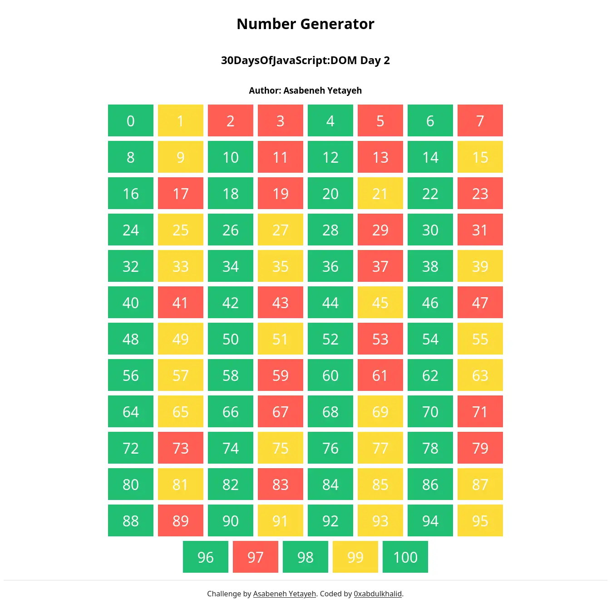
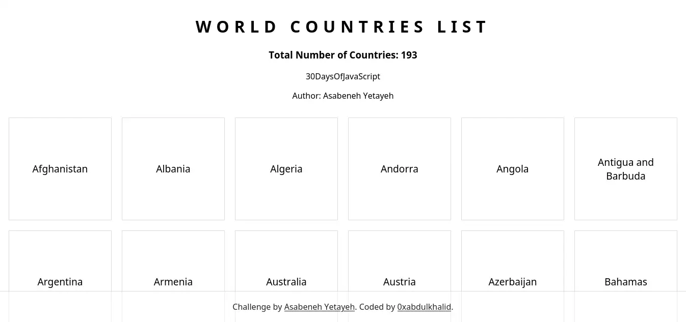
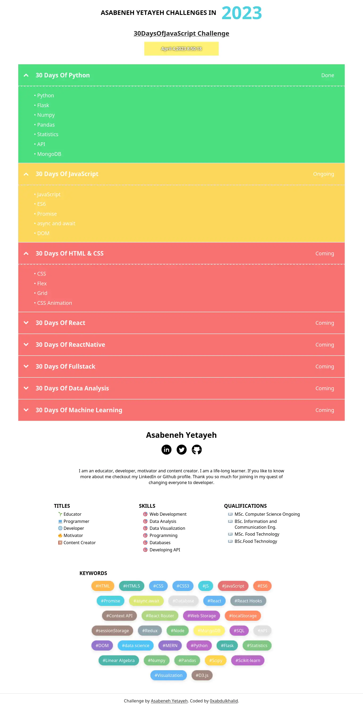

# 💻 Day 22: Exercises

### Exercises: Level 1

1. Create a div container on HTML document and create 100 to 100 numbers dynamically and append to the container div. 
   - Even numbers background is green
   - Odd numbers background is yellow
   - Prime numbers background is red

### Exercises: Level 2

1. Use the countries array to display all the countries.See the design

### Exercises: Level 3

Check the requirement of this project from both images(jpg and gif). All the data and CSS has been implemented using JavaScript only. The data is found on starter folder project_3. The drop down button has been created using [*details*](https://www.w3schools.com/tags/tag_details.asp) HTML element.

### SOLUTION PREVIEW:

| Project - Number Generator |
| :----:  |
|  |
| |
| Live Preview: [Here 🌐](https://0xabdulkhalid.github.io/30-days-of-javascript-solutions/day-22/project-1/) |

 

| Project - Display Countries Array |
| :----:  |
|  |
| |
| Live Preview: [Here 🌐](https://0xabdulkhalid.github.io/30-days-of-javascript-solutions/day-22/project-2/) |

 

| Project - Challenges Info |
| :----:  |
|  |
| |
| Live Preview: [Here 🌐](https://0xabdulkhalid.github.io/30-days-of-javascript-solutions/day-22/project-1/) |

 