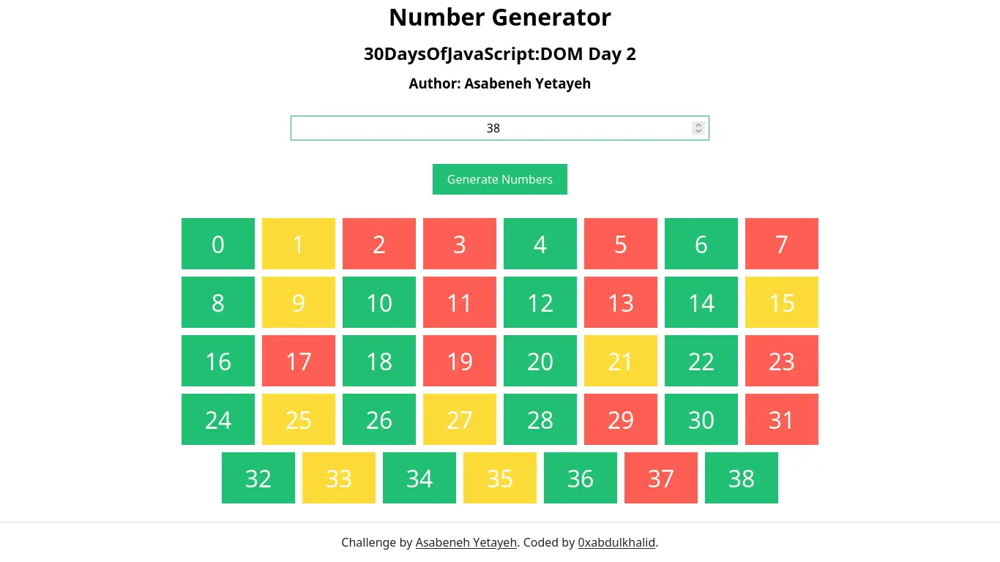
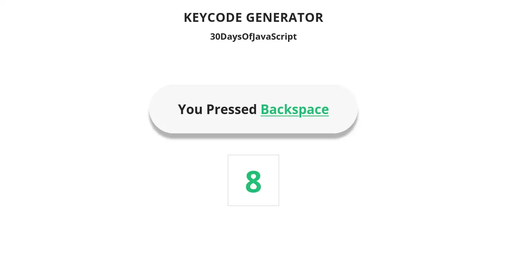

# 💻 Day 23: Exercises

## Exercises

### Exercise: Level 1

1. Generating numbers and marking evens, odds and prime numbers with three different colors. See the image below.

1. Generating the keyboard code code using even listener. The image below.

 

### SOLUTION PREVIEW:

| Level 1 Project - Number Generator |
| :----:  |
|  |
| |
| Live Preview: [Here 🌐](https://0xabdulkhalid.github.io/30-days-of-javascript-solutions/day-23/project-1/) |

 

| Level 2 Project - Keyboard Code Generator |
| :----:  |
|  |
| |
| Live Preview: [Here 🌐](https://0xabdulkhalid.github.io/30-days-of-javascript-solutions/day-23/project-2/) |

 