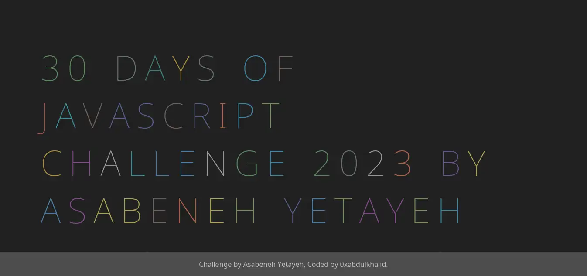

# 💻 Day 29: Exercises

1. Create the following animation using (HTML, CSS, JS)

 

### SOLUTION PREVIEW:

| Project - Animated Texts |
| :----:  |
|  | 
| |
| Live Preview: [Here 🌐](https://0xabdulkhalid.github.io/30-days-of-javascript-solutions/day-29/) |

 