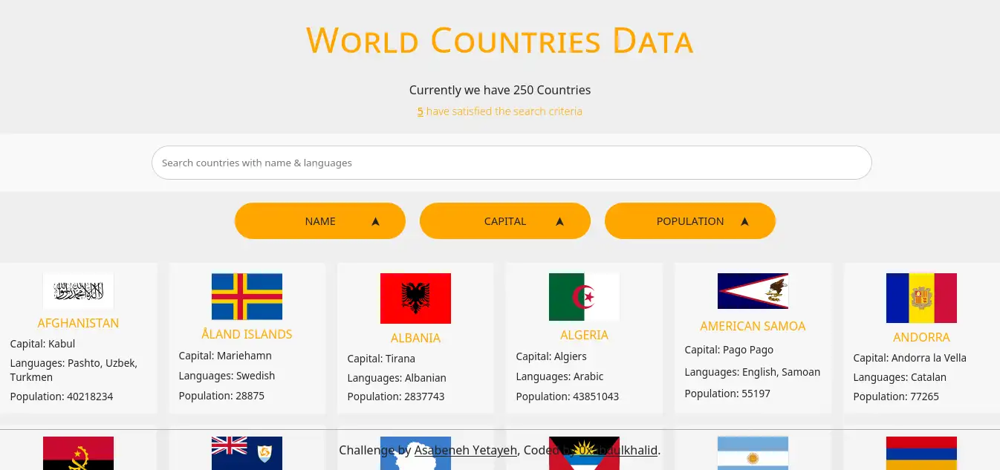
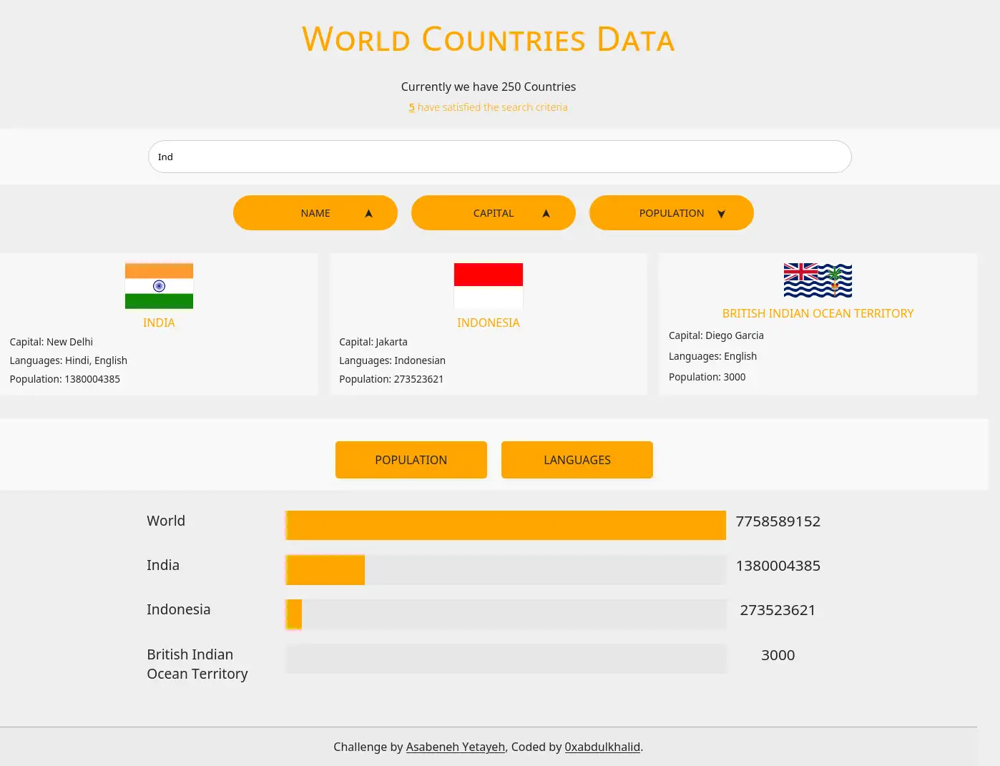
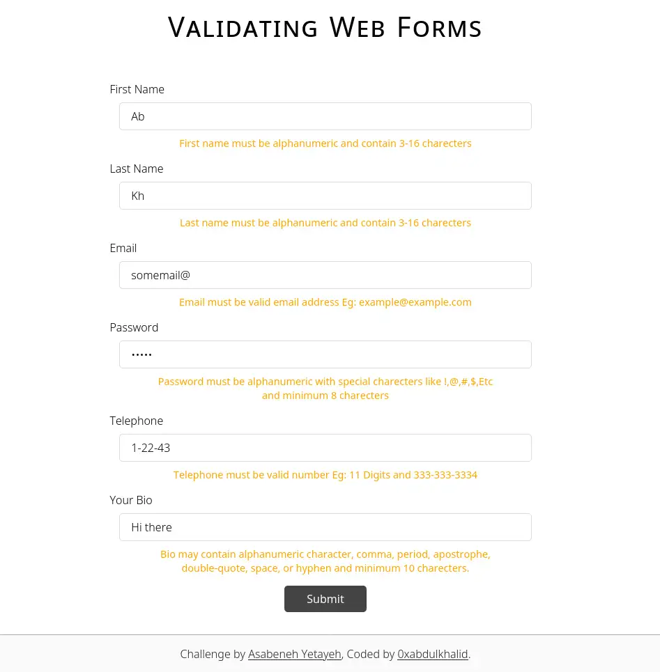

# 💻 Day 25: Exercises

1. Visualize the countries and spoken languages according to user input in the world using DOM(HTML, CSS, JS)

2. Validate the following form using Regular Expressions.

<!-- 

 -->

 

### SOLUTION PREVIEW:

| Project - Visualization of Countries Data |
| :----:  |
|  | 
|  | 
| |
| Live Preview: [Here 🌐](https://0xabdulkhalid.github.io/30-days-of-javascript-solutions/day-30/project-1/) |

 

| Project - Form Validation Using RegExp |
| :----:  |
|  | 
|  | 
| |
| Live Preview: [Here 🌐](https://0xabdulkhalid.github.io/30-days-of-javascript-solutions/day-30/project-2/) |

 